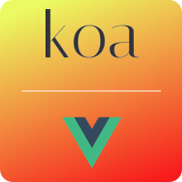

<p align="center"><a href="https://koa-vue-notes-web.innermonkdesign.com/" target="_blank"></a></p>

<p align="center">
  <a href="http://opensource.org/licenses/MIT"></a>
  <a href="https://twitter.com/intent/tweet?url=https%3A%2F%2Fgithub.com%2Fjohndatserakis%2Fkoa-vue-notes-api&text=Check%20out%20koa-vue-notes-api%20on%20GitHub&via=innermonkdesign">
  </a>
</p>

# Koa-API

This is a starter boilerplate inspired by [koa-vue-notes-api](https://github.com/johndatserakis/koa-vue-notes-api) and the famous [hackathon-stater](https://github.com/sahat/hackathon-starter) built using [Koa](http://koajs.com/) (2.5.1) as the backend and [Svelte](https://svelte.dev/) (3.17.1) as the frontend. Click [here](https://github.com/mylastore/svelte-boilerplate) to see the frontend svelte.js on github. I choose Koa and Svelte both for speed. 

## Example live app
Click [here](https://mylastore.com/) to view the app live. 

## Features
- Koa 2.5.1
- Fully written using async/await
- Koa-Router
- Koa-Ratelimit
- Koa-Bodyparser
- KCors
- Koa-Json-Error for JSON requests/responses
- Koa-Useragent to get client user-agent data
- Bcrypt
- Sendgrid Mailer for email
- Custom validation
- JWT
- Nodemon for running in development
- Babel
- PM2 for running in production
- MongoDB with Mongoose
- Seed data provided to get you started
- TODO - testing
- log4js for logging
- Password recover system with token
- Panigation example routes (quotes & users)
- And more...

## Installing / Getting started

``` bash
# install dependencies
npm install

# Development with nodemon with hot reload
npm start

# build for production with prettier and babel
npm run build

# serve in production using the pm2 ecosystem.json file
npm run production

# run prettier on the project
npm run pretty

# run tests
npm run test

# Rund seed data !important will rewrite your MongoDB data ##
npm run seed
```

#### Note

You willl need to make sure you have redis running (for the rate-limiter). I use homebrew. You can follow [this](https://medium.com/@petehouston/install-and-config-redis-on-mac-os-x-via-homebrew-eb8df9a4f298) guide. After installing and running redis, you should be able to enter `redis-cli ping` into a terminal and get `PONG` back.

## General Information

This backend has example data users, quotes and some admin settings.  This project ha a fully fleshed-out user login/signup/forgot/reset authentication system using JWT.

You'll need to create a `.env` file and place it in the root of your directory. Take a look at `example.env` and add your information as needed. For `JWT_ACCESS_TOKEN_EXPIRATION_TIME` you can set it to 5m, 5w, 5d etc - although 5m is what I'm using at the moment. Note - we don't set the NODE_ENV variable in the `.env` - we set it in the npm scripts. This lets us specifically set different environments as needed. Also make sure to set the `JWT_SECRET` variable - something random around 32 characters.

This project only responds and listens in JSON. Keep that in mind when send requests through Postman or your frontend.

### User Authentication Process

As mentioned in the frontend code, the user authentication process is this:

- User create an account
- User logs in
- The server sends and `accessToken`
- We take the `accessToken` and decode it using `jwt-decode`. This gets us the logged in user's information. Then we store the `accessToken`.
- Each protected endpoint will be expecting you to attach the `accessToken` you have to the call (using Authentication: Bearer). 

### PM2

This project features an `ecosystem.json` file that is the target of the PM2 implementation in production. Very simple - we just give it a name and some other basic info and PM2 handles the rest. Great library with awesome documentation.

The `src` folder is the heart of the program. I'll go over its subfolders now.

### controllers

We use controllers to keep our router thin. The controller's responsibility is to manage the request body and make sure it's nice and clean when it eventually gets sent to a `model` to make database calls. There are two controller files present - one for user signup/login/forgot... and one for notes. Note: the `UserActionController.js` is a little different then normal controllers, as I believe the actions of a user signup/login/forgot/reset are seperate from the normal actions for a user - so that's why `UserActionController.js` in written in a more *functional* way.

### db

I choose MongoDB  with mongoose for speed and fairly easy to used.

### middleware

Here I place any custom middleware the app is using. The custom middleware we're using is based on the `koa-jwt` library.

### models

Our models folder contains two model files - one for users and one for quotes. These models are where the actual database calls are made. This keeps things nice and neat - also make actions reusable for the future.

### routes

Very simple - here are our routes. I've broken it down into two files - this keeps things in control. Each route is nice and thin - all it's doing is calling a controller. Some routes are using that jwt middleware I mentioned earlier. Koa make it really nice and easy to add middleware to a route. Very cool.

### static

Static files - just used for the favicon.

### index.js

index.js isn't a folder - it's the brain of the app. Here you'll see we are attaching a bunch of middleware to our Koa instance. Very slick and straight-forward.

### Testing

This project uses Jest for testing WORK IN PROGRESS - TODO 

## Hit Me Up

Go ahead and fork the project! Message me here if you have questions or submit an issue if needed. I'll be making touch-ups as time goes on. Have fun with this!

## License

Copywrite 2020 Oscar Quinteros

[MIT](http://opensource.org/licenses/MIT)
